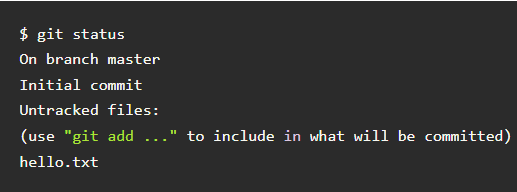
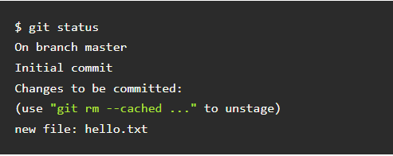
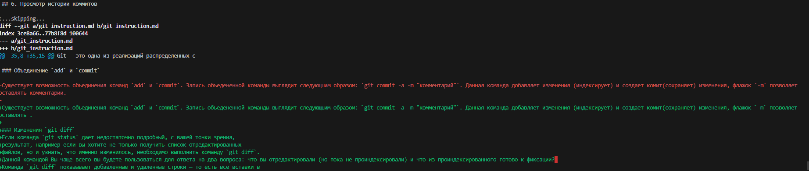
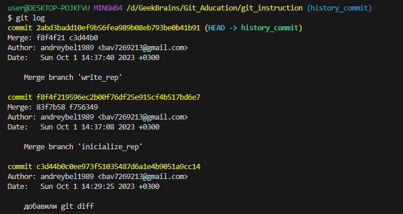
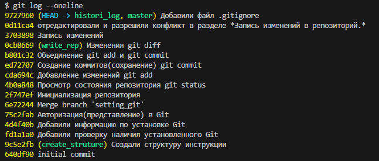
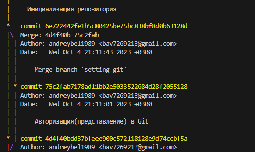
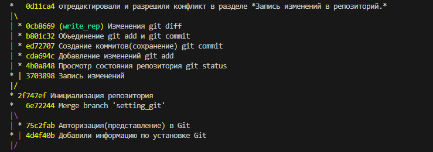
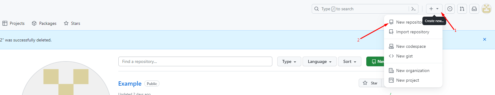
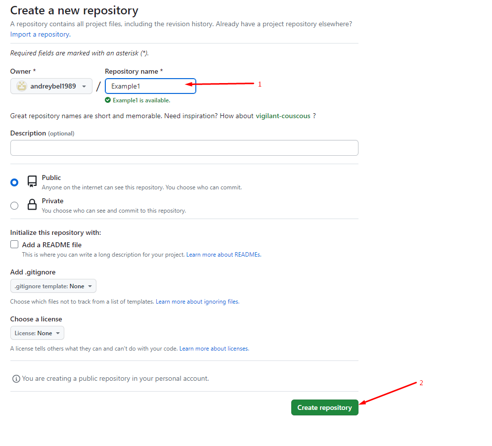

# Инструкция для работы с Git и удалёнными репозиториями

## Что такое Git?
Git - это одна из реализаций распределенных систем контроля версий, имеющая как и локальные, так и удаленные репозитории. Является самой популярной реализацией систем контроля версий в мире.

## 1. Проверка наличия установленного Git.
В терменале выполнить команду `git --version`. 
Если Git установлен, появиться сообщение с информацией о версии программы, иначе будет сообщение об ошибке.

## 2. Установка Git.
Загружаем последнюю версию Git c [сайта]( https://git-scm.com/downloads).
Устанавливаем с настройками по умолчанию.

## 3. Настройка Git.
При первом использовании Git необходимо представиться. Для этого нужно ввести в терминале 2 команды:
```
git config ­­global user.name "Oleg Yasnev" 
git config ­­global user.email oyasnev@gmail.com
```

## 4. Инициализация репозитория.
Для создания репозитория необходимо выполнить команду `git init` в папке с репозиториями и у Вас создасться репозиторий (появится скрытая папка .git)

## 5. Запись изменений в репозиторий.
### Просмотр состояния репозитория `git status`
Для того чтобы посмотреть __*текущее*__ состояние репозитория используется команда `git status`. Для этого необходимо в папке с репозиторием написать `git status`, и Вы увидите были ли изменения в файлах. Выполнение команды `git status` на нашем свежесозданном репозитории должно выдать следующее:  

  
Сообщение говорит о том, что файл *hello.txt* неотслеживаемый. Это значит, что файл новый и система еще не знает, нужно ли следить за изменениями в файле или его можно просто игнорировать. Для того, чтобы начать отслеживать новый файл, нужно его специальным образом объявить.  

### Добавление изменений `git add`
Для объявления файла и добавления  изменений(__индексация__) в коммит используется команда `git add`. Чтобы использовать данную команду напишите в папке с репозиторием `git add <имя файла>` Должны получить следующее:  
  
Файл готов к коммиту. Сообщение о состоянии также говорит нам о том, какие изменения относительно файла были проведены в области подготовки — в данном случае это новый файл, но файлы могут быть модифицированы или удалены.  

### Создание коммитов(сохранение) `git commit`
Теперь, когда область индексирования настроена нужным вам образом, можно
зафиксировать внесенные туда изменения. Помните, что все, оставленное неиндексированным, в том числе любые созданные или измененные файлы, для которых после редактирования не была выполнена команда `git add`, в текущий коммит не войдет. Все эти файлы останутся на вашем диске как измененные.
Для создания коммита(сохранения) необходимо выполнить команду `git commit -m "комментарий"`
Флажок `-m` задаст commit message - комментарий разработчика. Он необходим для описания закоммиченных изменений. И здесь работает золотое правило всех комментариев в коде: «Максимально ясно, просто и содержательно обозначь написанное!»

### Объединение команд `git add` и `git commit`
Cуществует возможность объединения команд `add` и `commit`. Запись объедененной команды выглядит следующшим образом: `git commit -a -m "комментарий"` или ```git commit -am "<комментарий>"```. Данная команда добавляет изменения (индексирует) и создает комит(сохраняет) изменения только тех файлов которые ранее были добавлены в индекс командой `git add <имя файла>`, флажок `-m` позволяет оставлять комментарии.

### Изменения `git diff`
Если команда `git status` дает недостаточно подробный, с вашей точки зрения,
результат, например если вы хотите не только получить список отредактированных
файлов, но и узнать, что именно изменилось, необходимо выполнить команду `git diff`.
Данной командой Вы чаще всего вы будете пользоваться для ответа на два вопроса: что вы отредактировали (но пока не проиндексировали) и что из проиндексированного готово к фиксации? 
Kоманда `git diff` показывает добавленные и удаленные строки — то есть все вставки в
программу.  


### Изменение крайнего комментария `git commit --amend -m <комментарий>`
Команда `git commit --amend -m <комментарий>` удобный способ изменить самый последний коммит. Он позволяет комбинировать поэтапные изменения с предыдущим коммитом вместо создания совершенно нового коммита.

## 6. Просмотр истории коммитов `git log`.
Команда `git log` выводит в обратном хронологическом порядке список сохраненных в данный репозиторий версий. То есть первыми показываются самые свежие коммиты. Как видите, рядом с каждым коммитом указывается его контрольная сумма SHA-1, имя и электронная почта автора, дата создания и сообщение о фиксации.  
 

### Просмотр истори коммитов в сокращенном виде `git log --oneline`
Команда `git log --oneline` позволяет просматривать историю коммитов в сокращенном виде, как показано на фото:  


### Команда `git log --graph`
Команда `git log --graph` создает графический обзор того, как различные ветки проекта разветвлялись и сливались с течением времени, как показано на изображении:
  

### Объединение команд `git log --oneline` и `git log --graph`
В резельтате выполнения команды `git log --oneline --graph` мы получим сокращенный вывод истории коммитов с графическим обзором разветвления и сливания веток проекта, как показано на изображении:  


## 7. Перемещение между сохранениями(коммитами) и ветками проекта.

### Команды git checkout и git switch

Для перемещениями между сохранениями или ветками проекта используется команда `git checkout <имя ветки(номер сохранения)>` или `git switch <имя ветки(номер сохранения)>` номером сохранения  является значения параметра commit c03d96a5b12ce5ff4446be47a9cb7d3077cd1b76 из журнала команды `git log`. Копировать весь номер из журнала изменений не обязательно, достаточна 4-6 разрядов.
Для возвращения в конечный коммит или ветку **master** необходимо выполнить команду `git checkout master` или `git swich master`.

## 8. Работа с изображениями.
Для добовления изображения необходимо выполнить следующюю команду:
``````
  
В квадратных скобках написан текст который будет выводиться если картинка не загрузиться.

## 9. Игнорирование файлов.
Для того, чтобы исключить из отслеживания в репозитории определенные файлы или папки необходимо создать файл ***.gitignore*** и записать в его их названия(```Git-Icon-1788C.png```) или шаблоны(```*.png```), соответствующие таким файлам или папкам.

## 10. Создание веток в Git.
По умолчанию имя основной веетки в Git - **master**  
Создать ветку можно командой:
```
git branch <имя новой ветки>
```
Список веток в репозитории можно просмотреть с помощью команды:
`git branch`.
Текущая ветка будет отмечена звездочкой **\*master**

### Переключение на ветку при создании 
При помощи команд `git checkout -b <имя ветки>` и `git switch -c <имя ветки>` мы одновременно создаем ветки и переключаемся на нее.

## 11. Слияние веток, разрешение конфликтов. 
Слияние используется в Git, чтобы собрать воедино разветвленную историю.  

### Команда `git merge`
Команда `git merge <имя ветки>` выполняет слияние отдельных направлений разработки, созданных с помощью команды `git branch`, в единую ветку. "Слив информации" происходит в ту ветку в которой была написана команда.  

### Разрешение конфликтов при слиянии. 

Слияние и конфликты являются неотъемлемой частью работы с Git.  
Обычно конфликты возникают, когда два человека изменяют одни и те же строки в файле или один разработчик удаляет файл, который в это время изменяет другой разработчик. В таких случаях Git не может автоматически определить, какое изменение является правильным. Конфликты затрагивают только того разработчика, который выполняет слияние, остальная часть команды о конфликте не знает. В этом случае ответственность за разрешение конфликта несут разработчики.  
Программа VSCode облегчает работу с конфликтами при слиянии веток. При обнаружении конфликта она предлагает выбрать один выбрать из четырех вариантов действия: "Принять существующий вариант", "Принять входящий вариант", "Принять оба варианта", "Сравнить  варианты"
После выбора подходящего варианта слияния, файл будет помечен как ```"modified:   instruction_git.md"``` необходимо выполнить команду `git commit -am "комментарий"`  

## 12. Удаление веток.
Необходимо помнить что удаление ветки происходит с другой ветки.  
Удаление веток происходит при помощи команды `git dranch -d <имя ветки>`.  
Но эта команда  работает не во всех случаях. Если в ветке присутствуют несмерженные изменения или незапушенные коммиты, флаг `-d` не позволит удалить такую локальную ветку.Это связано с тем, что эти коммиты нигде более не отслеживаются, и Git защищает вас от случайной потери этих данных. Если все же попытаться удалить такую ветку, Git выдаст ошибку:

```$ git branch -d del_branch 
error: The branch 'del_branch' is not fully merged.
If you are sure you want to delete it, run 'git branch -D del_branch'.
```  

В этом случае необходимо использовать команду `git dranch -D <имя ветки>`
Флаг -D с большой D (сокращенная запись опции --delete --force), принудительно удаляет локальную ветку, вне зависимости от ее статуса мержа.

## 13. Работа с удаленными репозиториями.

Удалённые репозитории представляют собой версии вашего проекта, сохранённые в интернете или ещё где-то в сети. У вас может быть несколько удалённых репозиториев, каждый из которых может быть доступен для чтения или для чтения-записи.

### Начало работы с удаленными репозиториями.

Для начала работы с удаленными репозиториями необходимо создать аккаунт на [GitHub]( https://github.com) или каком-нибудь другом ресурсе.

Создать новый репозиторий на **GitHub**. Для этого необходимо нажать в верхней часть страницы значек "+" и выбрать раздел `new repository`, как показано на изображении:  

  

Для первоночального знакомства достаточно ввести имя репозитория все остальное оставить по умолчанию и нажать `Create repository` как показано на изображении:  

  

Если локального репозитория еще не существует, в терминале необходимо выполнить следующий блок команд:  

```
echo "# Example1" >> README.md
git init
git add README.md
git commit -m "first commit"
git branch -M main
git remote add origin https://github.com/andreybel1989/Example1.git
git push -u origin main
```
Если локальный репозиторий уже существует достаточно выполнить следующие команды:  

```
git remote add origin https://github.com/andreybel1989/Example1.git
git branch -M main
git push -u origin main
```  
### Команды `git pull` и `git push`

Для получения актуального состояния проекта из удаленного репозитория необходимо ввести команду `git pull`. Эта командa помимо того, что выкачивает содержимое удаленного репозитория так еще и производит слияние (`merge`) существующего локального репозитория с удаленным.

Для загрузки _локального_ репозитория в _удаленный_ необходимо выполнить команду `git push`


